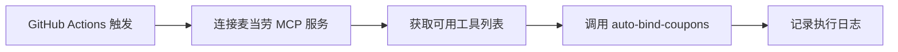

<div align="center">

# 🍔 麦当劳优惠券自动领取工具

*基于 MCP 协议的自动优惠券管理系统*

[](https://opensource.org/licenses/MIT)
[](https://nodejs.org/)
[](https://www.typescriptlang.org/)

</div>

---

## ✨ 项目简介

这是一个利用模型上下文协议（MCP）自动领取麦当劳中国优惠券的工具。通过 GitHub Actions 实现每周自动运行，让你再也不会错过任何优惠！

### 🎯 核心特性

<table>
<tr>
<td width="50%">

#### 🎟️ 自动领取
- 单次调用 `auto-bind-coupons` 工具
- 自动领取所有可用优惠券
- 无需任何 AI 模型或提示词

</td>
<td width="50%">

#### 🔐 安全可靠
- GitHub Secrets 加密存储凭证
- 完整的错误处理和日志记录
- 零安全漏洞

</td>
</tr>
<tr>
<td>

#### ⚡ 自动化执行
- 每周一上午 11:00 自动运行
- 支持手动触发
- 失败时自动上传日志

</td>
<td>

#### 🛠️ 技术栈
- Node.js + TypeScript
- 麦当劳 MCP 服务
- GitHub Actions

</td>
</tr>
</table>

---

## 🚀 快速开始

### 📋 前置要求

#### 1️⃣ 获取麦当劳 MCP Token

1. 访问 [麦当劳开放平台](https://open.mcd.cn/mcp)
2. 使用手机号登录
3. 点击右上角进入「**控制台**」
4. 点击「**激活**」按钮获取你的 MCP Token

### ⚙️ 配置 GitHub Secrets

进入你的 GitHub 仓库设置页面：`Settings` → `Secrets and variables` → `Actions` → `New repository secret`

添加以下密钥：

| 密钥名称 | 说明 | 获取方式 |
|---------|------|---------|
| `MCD_MCP_TOKEN` | 麦当劳 MCP 令牌 | 从麦当劳开放平台获取 |

---

## 💻 本地开发

### 安装依赖

```bash
# 克隆仓库
git clone https://github.com/你的用户名/auto-mcd-coupon.git
cd auto-mcd-coupon

# 安装依赖
npm install

# 构建项目
npm run build

# 运行脚本
npm start
```

### 开发模式

```bash
# 使用 tsx 直接运行，无需构建
npm run dev
```

### 环境变量配置

在项目根目录创建 `.env` 文件：

```bash
MCD_MCP_TOKEN=你的麦当劳MCP令牌
```

---

## 🤖 自动化工作流

### GitHub Actions（推荐）

#### 定时执行

工作流将在以下时间自动运行：
- **每周一上午 11:00**（北京时间）

#### 手动触发

1. 进入仓库的 `Actions` 标签页
2. 选择 `Auto Claim McDonald's Coupons` 工作流
3. 点击 `Run workflow` 按钮
4. 选择分支并确认运行

### 本地 Systemd 用户服务（Linux）

如果你想在本地 Linux 系统上设置自动运行，可以使用 systemd 用户服务：

#### 安装服务

```bash
# 运行安装脚本
./install-systemd.sh
```

#### 管理服务

```bash
# 查看定时器状态
systemctl --user status auto-mcd-coupon.timer

# 查看服务日志
journalctl --user -u auto-mcd-coupon.service

# 停止定时器
systemctl --user stop auto-mcd-coupon.timer

# 禁用定时器
systemctl --user disable auto-mcd-coupon.timer

# 手动运行一次
systemctl --user start auto-mcd-coupon.service
```

**执行时间：** 每天上午 10:45 自动运行

---

## 📖 工作原理



**详细流程：**

1. 🔌 **连接服务** - 使用 MCP Token 连接麦当劳开放平台
2. 🔍 **发现工具** - 获取 MCP 服务提供的所有工具（查询、领取等）
3. 🎟️ **自动领取** - 单次调用 `auto-bind-coupons` 批量领取优惠券
4. 📝 **记录日志** - 详细记录整个过程以便调试

---

## 🔧 故障排查

### 常见问题

<details>
<summary><b>❓ 遇到速率限制错误（429）</b></summary>

麦当劳 MCP 服务限制每分钟最多 600 次请求。如果遇到此错误，请等待一段时间后重试。

</details>

<details>
<summary><b>❓ 工作流执行失败</b></summary>

1. 检查 `Actions` 标签页查看详细日志
2. 失败的运行会自动上传日志文件（保留 7 天）
3. 验证你的 Secrets 配置是否正确

</details>

<details>
<summary><b>❓ 无法连接到 MCP 服务</b></summary>

1. 确认 `MCD_MCP_TOKEN` 有效且未过期
2. 访问麦当劳开放平台确认服务状态

</details>

---

## 📄 开源协议

本项目采用 [MIT](LICENSE) 协议开源。

## ⚠️ 免责声明

本项目仅供学习和研究使用。请遵守麦当劳的服务条款，合理使用优惠券领取功能。

---

<div align="center">

**如果这个项目对你有帮助，请给个 ⭐️ Star 支持一下！**

Made with ❤️ by the community

</div>
